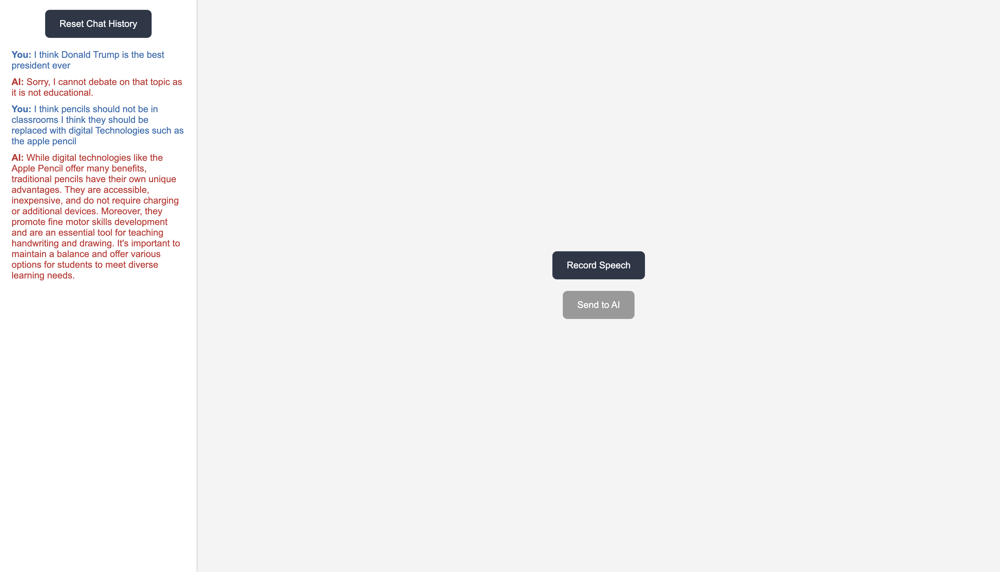

# Debate AI
An AI that debates on any educational topic that you want to debate against. 

## Setup
To begin, clone this repository. 

> *This project requires the use of OpenAI's API key. You can either (in the directory) use this command: `export OPENAI_API_KEY=your_api_key` or make a .env file with the contents `OPENAI_API_KEY=your_api_key`.*

Inside this repository:
1. Make a python environment with the following command -> ```python -m venv .venv```
    - For Mac and linux users:
        - ```source .venv/bin/activate```
    - For windows users:
        - ```env\Scripts\activate```

2. Add your OPENAI_API_KEY (environment variable). Refer to the notice above for more info.

3. Install the requirements using this command -> ```pip install -r requirements.txt```

4. Run the main script -> ```gunicorn main:app```

You are all set! It should give you a link like **Listening at: http://127.0.0.1:8000**

To exit the program, press Control and C at the same time.

---

## Project details

This project is mainly for students who want practice debating and to help boost their confidence levels.

The LLM used to acheive this is ChatGPT's 4o model which my project utilizes it's audio and text features to bring a human-like voice for the best possible debate.

### How It works:

This whole project is a Flask server which hosts one webpage. When you finish recording your take of the debate, the transcription process on the backend (using SpeechRecognition from Google) takes place and adds it to the chat history. You can re-take it or send the take to the AI which will use the chat history and your take to debate. *Please note, the AI model is instructed to oppose your arguments.* It uses the new GPT 4o audio model to debate and convert the text into a human-like voice.  Then it plays it along with the transcription being added to the chat history on the side for reference. When you finished the debate, you can always wipe chat history to start afresh.

### Demo Screenshot:


Thank you for viewing my project!